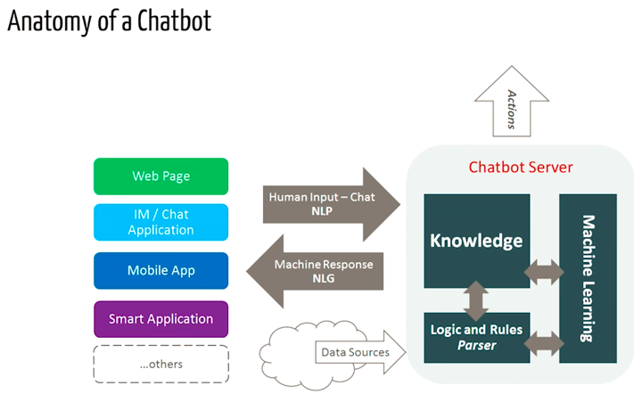

###  Create a chatbot that allows the user (students of Simplon) to intercat with another and get answers quick on simple questions such as student info. 

We will be using a Self learning bot ( these are the ones that use some Machine Learning-based approaches and are definitely more efficient than rule-based bots). These bots can be of further two types: Retrieval Based or Generative

#### Contexte :
Les chatbots sont de plus en plus utilisés pour simplifier les échanges entre l’ordinateur et
l’humain ; ils permettent, grâce « Natural Language Processing » de communiquer de
manière naturelle et d’obtenir des informations précises sans nécessité d’interface
utilisateur complexe.
#### Projet :
Vous réaliserez un chatbot permettant de communiquer de façon simple avec la base de
données contenant les informations de la promotion : Nom, Prénom, Date de Naissance,
Numéro de Téléphone, Contact d’Urgence, Adresse, etc
vez gérer les cas d’erreurs :

Vous êtes libre des technologies utilisées. Le prérequis est d’utilisé au maximum Python.
Le chatbot peut être déployé sur Messenger, Discord, ou tout autre support à votre
convenance. La base de données Cloud que vous avez créé sur Google peut être dupliqué sur
Microsoft Azure si besoin.
#### Collaboration :
Vous devez créer un repository Github et collaborer ensemble via Git. Chacun doit avoir au
moins un commit de code.
#### Présentation :
Vendredi après-midi vous réalisez une présentation et une démonstration de votre projet
devant l’ensemble du groupe. La présentation doit être professionnel : mettez-vous dans des
conditions de présentation d’un projet réalisé par Exakis pour un client. La présentation doit
aborder les usages ainsi que la technique.