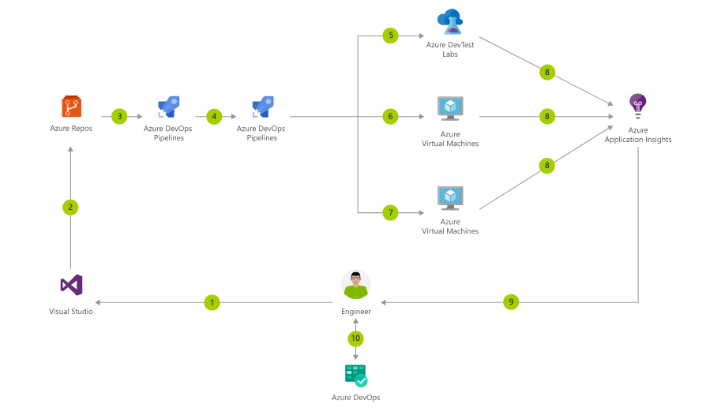

# How-to deploy our chatbot on Azure services : 

#### Once the application works on a local server and there are no extra modifications necessary we can deploy it on a virtual machine using the Azure tools.

A Git repo is necessary for managing the app source code and infrastructure code. 

We'll be using Azure Bot Services [ABS](https://docs.microsoft.com/en-us/azure/bot-service/?view=azure-bot-service-4.0/)

Our bot is a closed omain bot (or Specialist Bot).

Chatbots work as long as they understand the following to repsond to the users' question :
 1. what is the user talking about ? (intent)
 2. did the user mention anything specific ? (entities)
 3. what should the bot ask to get further details from the user ? (dialog/maintaining context)
 4. how to fulfill the user request ? (response/fulfillment)

For further detail on how Chatbots work click [here](https://www.datasciencecentral.com/profiles/blogs/a-comparative-analysis-of-chatbots-apis)

Then, create a VM on Azure Services. 

### For further info : 
click [here](https://towardsdatascience.com/chatbots-are-cool-a-framework-using-python-part-1-overview-7c69af7a7439)
